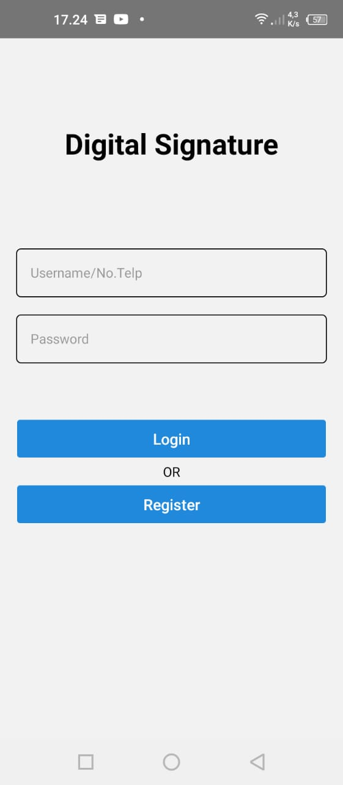
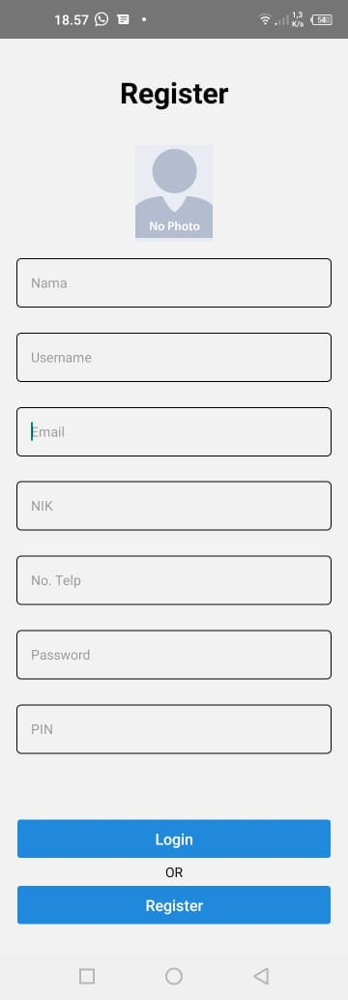
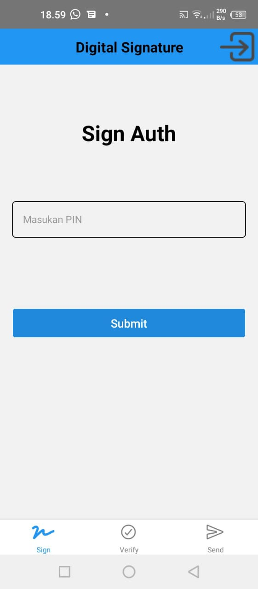
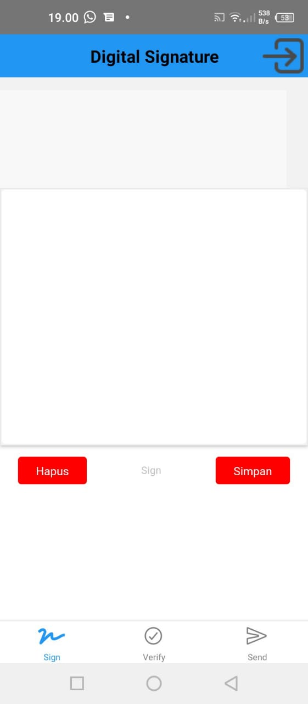
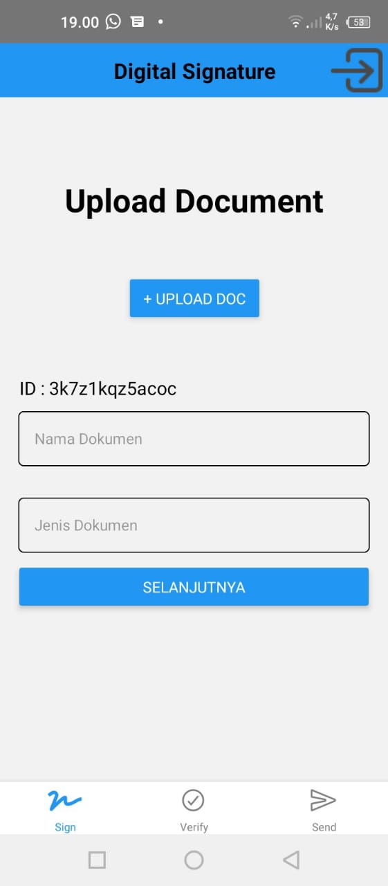
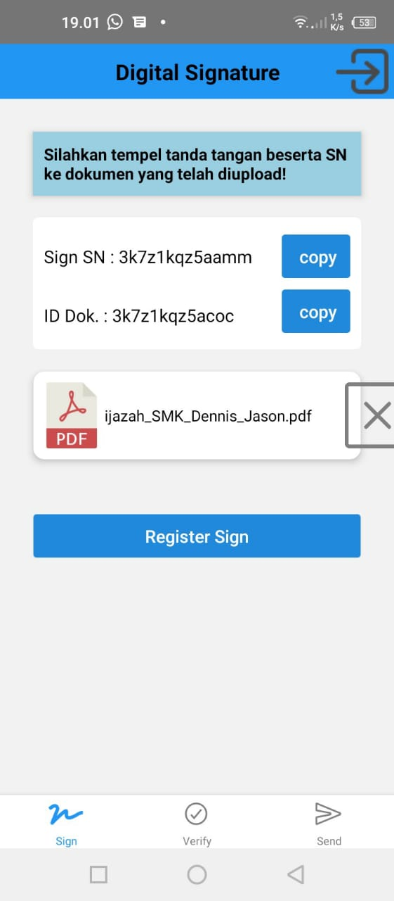
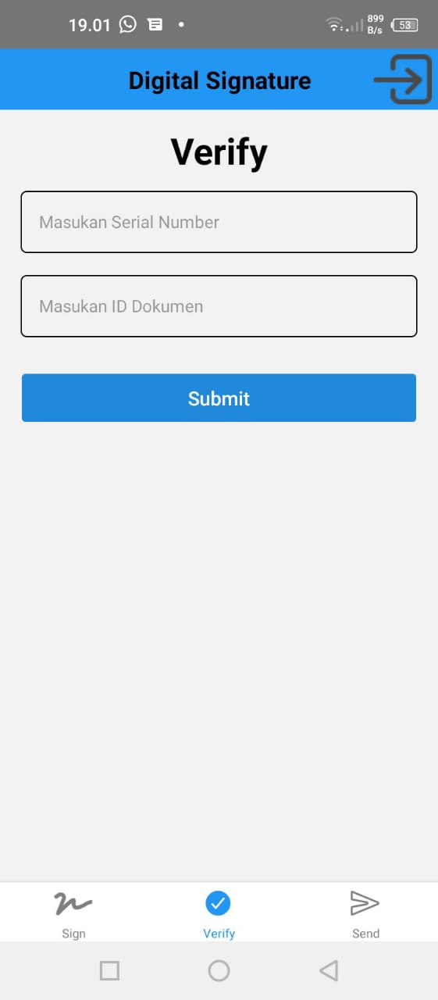
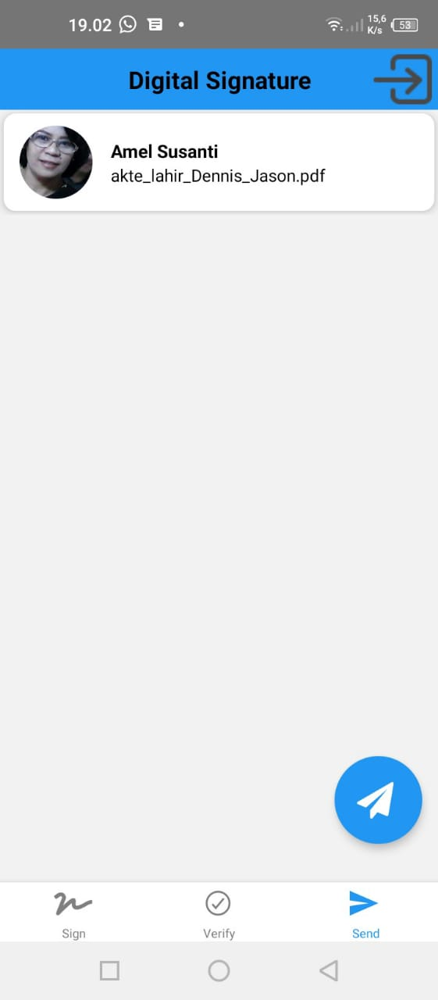
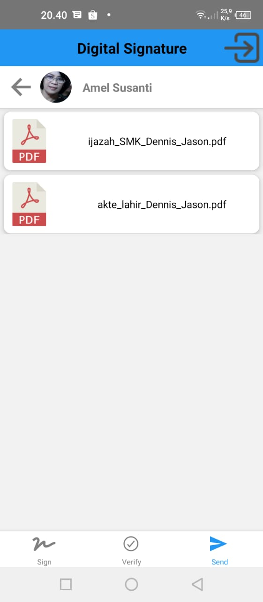
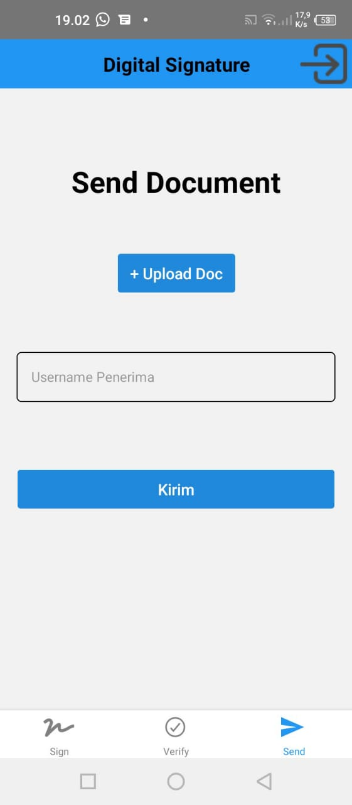

# Secure Digital Signature
Aplikasi tanda tangan digital yang aman karena dilengkapi serial number dan id dokumen pada setiap tanda tangan. Dilengkapi juga fitur untuk melakukan verifikasi tanda tangan.

## Stack Teknologi

**1. Bagian Frontend**
* React Native
* React Navigation
* Axios
* Socket.io
* dll

**2. Bagian Backend**
* Node.JS
* Express JS
* MySql
* Socket.io
* dll

## Tampilan UI
         

## Link Skripsi Saya
Klik link di bawah:
https://drive.google.com/file/d/17oS8xLh-6zOiPCvfxrvg-E9w3L0Ghb2p/view?usp=sharing

Ket: Skripsi sudah disidangkan dan sudah di ACC, hanya tinggal menunggu selesai proses TTD saja.

## Cara Menjalankan Aplikasi
1. Hubungkan HP dengan kabel data
1. Buka folder dengan VSCode
1. Jalankan terminal
1. Jalankan perintah `npm start`
1. Jalankan perintah `npx react-native run-android`
